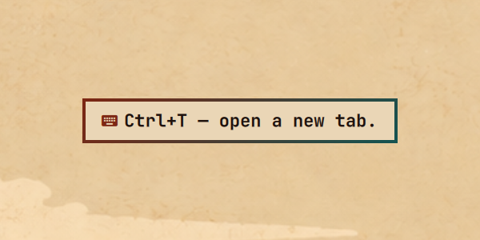

# Keyboard Coach

[](https://github.com/tcballard/omarchy-badges)

Keyboard Coach watches your mouse clicks on Omarchy and shows the keyboard shortcut that would have
done the same thing. Suggestions are deterministic: each one comes from an indexed source, and a
click with no reliable keyboard equivalent shows nothing.



## How a click is resolved

Passive Hyprland bindings send tiny press and release events to a systemd user daemon over a Unix
socket; the click still reaches the application. On press, the daemon captures what is under the
pointer before the UI can change:

- **Omarchy surfaces.** The layer under the pointer comes from Hyprland's IPC socket. For the bar,
  Omarchy's live bar geometry identifies the widget and its panel position.
- **Windows.** The window under the pointer comes from Hyprland, and the control under the pointer
  from AT-SPI. Wayland gives accessible windows no screen position, so the point is translated
  into window-local coordinates, and scaled inside Chromium/Electron web documents, which publish
  physical pixels. Controls inside a web page are marked as page content and carry the page host.

- **herdr.** herdr draws its sidebar, tabs and panes as terminal text, which has no accessible
  controls. When the window runs a herdr client, the daemon follows that session's API events and
  resolves the click by what it changed: focusing tab 3 is `Alt+3`, the next workspace in the
  sidebar is `Alt+Down`, the pane to the left is `Ctrl+Alt+Left`. Keys come from the herdr
  shortcut index, so they follow your `config.toml`.

The first matching source wins:

1. App command packs from `assets/commands/` and `~/.config/keyboard-coach/commands/`, plus
   shortcuts Omarchy plugins declare through the [plugin shortcut contract](docs/shortcut-contract.md).
2. Omarchy bindings. Hyprland's Lua config reports every binding command as an opaque `__lua`
   reference, so ingestion replays the config in a sandboxed Lua interpreter
   (`scripts/hypr-bind-dump.lua`) to recover each binding's keys, description, and command. A bar
   widget resolves to its named binding (`Super+Ctrl+A` for Audio), then to its `Bar panel N`
   binding.
3. Shortcuts the control publishes itself: `aria-keyshortcuts` on web pages, accelerators on GTK
   and Qt menu items, or a shortcut at the end of its label or tooltip, such as `Play (k)`.
4. Application shortcuts from the shortcut index (below), matched by the control's label.
5. The Omarchy app launcher, for bar widgets named after an installed app.
6. The base catalog in `assets/base-catalog.json`: Omarchy menu navigation and a few anchored,
   non-web edit commands.

Browser packs match only browser UI (`default_match` scopes them away from page content), so a link
named "Previous" on a website is not reported as `Alt+Left`. One pack covers the whole Chromium
family — Chrome, Chromium, Brave, Vivaldi, Edge, Thorium and the app windows they install for web
apps — and another the Firefox family, including Zen, LibreWolf and Floorp. Commands only one
browser has, such as Brave's Tor window, stay in that browser's own pack.

Buttons that name themselves differently in every browser are matched by intent rather than by
label: the hamburger button is `Brave` described as "Customize and control Brave" in one browser
and `Customize and control Google Chrome` in the next, and both resolve to the same
`open-application-menu` intent.

Ingestion reads the `Default` profile `Preferences` of every installed Chromium browser for
shortcuts the user reassigned inside it, and maps Chromium and Brave command IDs onto them. A
reassignment applies only to the windows of the browser it was read from, so one browser's custom
keys are never suggested inside another.

## Shortcut index

`keyboard-coach-harvest`, written in Rust, reads each installed application's own shortcut
definitions without running it, into `~/.local/share/keyboard-coach/shortcuts.json`:

- GTK 3, GTK 4 and libadwaita apps: shortcut windows, menus and accelerators compiled into the
  executable's GResource bundles.
- LibreOffice: its accelerator and command-label registry, per module.
- KDE apps: the `KStandardShortcut` set every KXmlGui application inherits, with the reassignments
  from the app's own config file and from `kdeglobals` layered on top. A KDE app is covered the
  moment it is installed, before it has ever run.
- Visual Studio Code and its forks (VSCodium, Code - OSS, Cursor, Windsurf): the defaults for the
  commands behind its clickable views, with the user's `keybindings.json` layered on top.
- foot, mpv and imv: their shipped defaults with the user's config applied on top.
- lazygit's default config, and Omarchy's tmux and herdr keybinding menus.

Qt, Electron and web apps have no such file, and neither do the actions a KDE app adds itself. For
those, the daemon captures shortcuts from the running application's accessibility tree in the
background: once for each window class as its first window opens, so an application is known before
it is first clicked, and after a click at most once every 15 minutes per window (and per site for
web pages), into `observed.json`:

- Qt and GTK report the accelerator of every menu item, including items of closed menus. Mnemonics
  (`Alt+N` for `Read-O&nly`) are ignored inside menus, where they only work while the menu is open.
- Web pages report `aria-keyshortcuts` and tooltips such as `Play (k)`. Page shortcuts are kept per
  site and only match controls on that site. A binding shared by several differently named
  controls moves within a region rather than activating one of them, so it is dropped.

Captures accumulate: a shortcut stays known after its menu or tooltip is gone, and a newer capture
of the same title replaces an older one. Application shortcuts never match controls inside web pages.

The daemon re-indexes after changes to Hyprland config, Omarchy plugins, desktop entries, command
packs, Brave preferences, or the shortcut sources above. A failed re-index is logged and retried on
the next change.

## Install

Keyboard Coach needs `socat`, a Lua 5.5 interpreter (`lua`), and a Rust toolchain (`cargo`, or `mise`
with this repository's `mise.toml`) to build the harvester:

```sh
sudo pacman -S --needed socat lua rust
```

Add the plugin, then run its installer:

```sh
omarchy plugin add https://github.com/n0mahd/keyboard-coach.git
~/.config/omarchy/plugins/io.github.n0mahd.keyboard-coach/scripts/install.sh
```

The installer builds the harvester and installs these, all under your home directory:

- the `keyboard-coach` executables in `~/.local/bin`
- the `keyboard-coach` systemd user service, enabled under `graphical-session.target`
- the passive click bindings, added between `-- BEGIN keyboard-coach` and `-- END keyboard-coach`
  in `~/.config/hypr/bindings.lua` (the original is first saved as `bindings.lua.bak.keyboard-coach`)
- GTK accessibility (`toolkit-accessibility`), `--force-renderer-accessibility` in every existing
  `*-flags.conf`, and `QT_LINUX_ACCESSIBILITY_ALWAYS_ON=1` in
  `~/.config/environment.d/90-keyboard-coach.conf`, so AT-SPI can see controls

An application publishes nothing to the coach until its toolkit's accessibility is on, so those
three settings are what most coverage depends on. It then enables the Omarchy banner panel. Restart
Chromium-based browsers once, and log out once for the Qt setting. `keyboard-coach doctor` reports
what is still missing. To install from a checkout instead, run `scripts/install.sh` from it.

After `omarchy plugin update io.github.n0mahd.keyboard-coach`, run the installer again.

## Remove

```sh
~/.config/omarchy/plugins/io.github.n0mahd.keyboard-coach/scripts/uninstall.sh
omarchy plugin remove io.github.n0mahd.keyboard-coach
```

The uninstaller stops and removes the service, the executables, the generated index, everything the
coach recorded, the click bindings, and the `QT_LINUX_ACCESSIBILITY_ALWAYS_ON` file it wrote. It keeps your command
packs and settings in `~/.config/keyboard-coach`, and the GTK and Chromium accessibility settings,
which other tools may rely on.

## Use

- `Super + Ctrl + Alt + M`, or `keyboard-coach toggle`, pauses and resumes coaching. `pause`,
  `resume`, and `status` do the same from a terminal.
- `keyboard-coach last` prints the context and suggestion for the most recent click.
- `keyboard-coach inspect 3` waits three seconds, then prints the context under the pointer.
- `keyboard-coach coverage` reports indexed sources, shortcuts per app, and the apps with unmatched
  clicks.
- `keyboard-coach doctor` reports, for every open window, whether the coach can see it, what its
  toolkit is, how many shortcuts are indexed for it, and the one setting that would change the
  answer. It also checks the click bindings, the catalog, and each toolkit's accessibility setting.
- `keyboard-coach report` ranks the clicks you make that already have a keyboard equivalent, and
  says whether you are making fewer of them than the week before. `--days N` changes the period.
- `keyboard-coach forget` deletes everything the coach has recorded, and says what it removed.
- `keyboard-coach-harvest --summary` lists what each app's static sources provide, and
  `keyboard-coach-harvest observe --pid PID --class CLASS --print` captures a running window now.
- Every click is resolved: a new suggestion replaces the banner on screen, and a click with no
  suggestion clears a banner left from an earlier click.

## Settings

Coaching is deliberately plain by default: every click with a keyboard equivalent shows one. If
that is too much, `~/.config/keyboard-coach/config.json` changes it. Every key is optional, and a
malformed file falls back to the shipped behaviour rather than stopping the coach.

```json
{
  "banner_duration_ms": 2000,
  "repeats_before_suggesting": 3,
  "repeat_window_hours": 168,
  "stop_after_suggestions": 10,
  "mute_apps": ["^signal$"],
  "mute_suggestions": ["^Ctrl\\+T\\b"],
  "ignore_apps": ["^org\\.keepassxc\\."],
  "history": true,
  "quiet_hours": {"from": "22:00", "to": "07:00"}
}
```

`repeats_before_suggesting` waits until the same action has been clicked that many times within
`repeat_window_hours` before saying anything, so a one-off click stays quiet and a habit does not.
`stop_after_suggestions` stops repeating one you have already been shown that often. `mute_apps`
and `mute_suggestions` are regular expressions, matched against the window class and the banner
text; muting a suggestion is how you retire a shortcut you have learned.

`ignore_apps` and `history` are about privacy rather than coaching, and are described below.

## Privacy

The coach resolves a click by looking at what is under the pointer, so it can see whatever is on
screen. What it keeps, and where, is therefore part of the design:

- **Nothing leaves the machine.** Neither the daemon nor the harvester contains any network code
  or depends on a network library; the only sockets they open are Hyprland's, the session
  accessibility bus, and their own. A test fails if that ever changes.
- **Everything recorded is created `0600`**, in directories under your home that only you can
  enter. There are no other copies.
- **What is recorded is deliberately thin.** The suggestion log holds a timestamp, the window
  class and the shortcut text. The unmatched-click log holds a timestamp, the window class, the
  role of the control and, for a web page, its host — never a control's label, a window title, a
  URL path, a file name, or anything you typed.
- **Titles and labels stay in memory.** The one exception is the most recent click, kept for
  `keyboard-coach last` in `$XDG_RUNTIME_DIR`, which is RAM and is gone when you log out.
- **`keyboard-coach doctor` lists every file the coach holds**, with its size and mode, so the
  answer to "what does it have on me" is one command. **`keyboard-coach forget`** deletes all of
  them, captures included; your settings and command packs stay.
- **`ignore_apps` puts an app out of reach.** A window whose class matches is never inspected at
  all: no accessibility read, not even its title, no background capture, nothing written down.
  It is the right setting for a password manager.
- **`"history": false`** stops both logs being written. The settings that count repeats need the
  log, so they stop working too; everything else is unaffected.

## Develop

`tests/corpus/cases.json` holds click contexts and the suggestion each must produce, including clicks
that must stay silent. It runs against `tests/corpus/catalog.json`, which is compiled from the shipped
assets and fixtures; run `tests/corpus/build_catalog.py` after changing either. Every implementation
reads the same corpus.

```sh
python3 -m unittest discover -s tests
mise exec -- cargo test
```

## License

[MIT](LICENSE)
